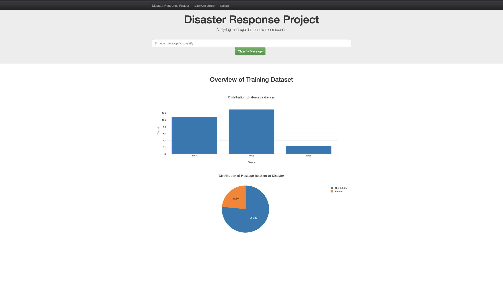

# Machine Learning for Disaster Response
This project leverages ETL (Extract, Transform, Load) and Machine Learning pipelines to process and classify disaster-related messages. The goal is to help emergency responders quickly identify and prioritize messages during crises.

The results of these pipelines are displayed through an interactive Flask web application, which includes:
- A bar chart showing the count of message types across different genres.
- A pie chart displaying the percentage of disaster-related vs. non-disaster-related messages.
- A text classifier that predicts the topic of an input message.
- A word cloud highlighting the most common words in disaster-related messages.



## **Running the Python Scripts**  

### **Step 1: Process the Data (ETL Pipeline)**  
This script loads, cleans, and saves the dataset into an SQLite database.  

Run the following command:  
```bash
python data/process_data.py data/disaster_messages.csv data/disaster_categories.csv data/DisasterResponse.db
```

---

### **Step 2: Train the Model (ML Pipeline)**  
This script trains a machine learning model to classify disaster messages.  

Run:  
```bash
python models/train_classifier.py data/DisasterResponse.db models/classifier.pkl
```

---

 

---

## **Running the Web Application**  

### **Step 3: Launch the Web App**  
Navigate to the `app` directory and start the Flask web application:  
```bash
cd app
python run.py
```
Then, open a web browser and go to:  
```
http://localhost:3001
```
 


# Languages & Libraries
* languages: Python, SQL
* libraries: pandas, matplotlib, numpy, sqlite, sqlalchemy,nltk, sklearn, re

## **Repository Files Explanation**  

- **`data/process_data.py`** → Extracts, transforms, and loads data into `DisasterResponse.db`.  
- **`models/train_classifier.py`** → Trains and saves the disaster response classification model.  
- **`app/run.py`** → Starts the Flask web app for message classification.  
- **`DisasterResponse.db`** → SQLite database storing cleaned disaster messages and categories.  
- **`classifier.pkl`** → Trained model for classifying new disaster messages.
- **`ETL_Pipeline_Preparation.ipynb`**  → Notebook containing prep for ETL pipeline
- **`ML_Pipeline_Preparation.ipynb`**  → Notebook containing prep for ML pipeline
- **`requirements.txt`** → List of required Python packages. 

